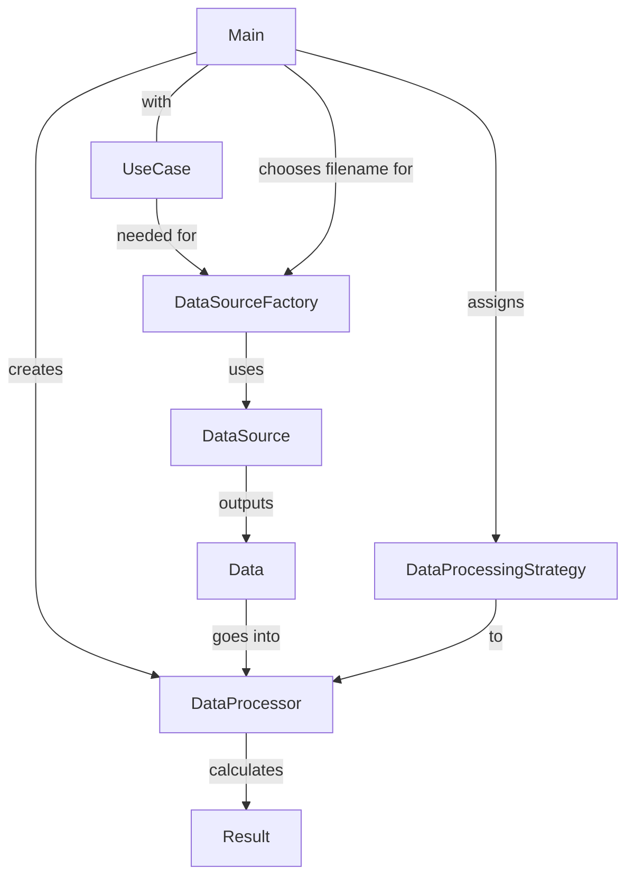
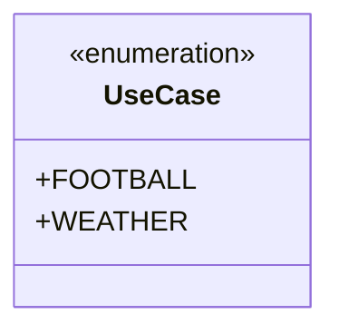
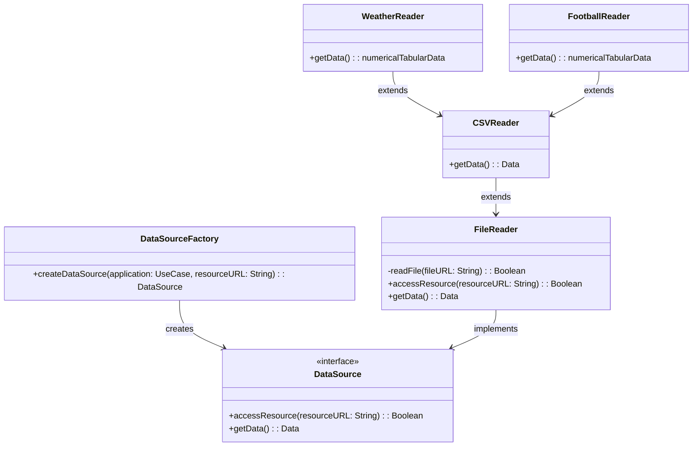
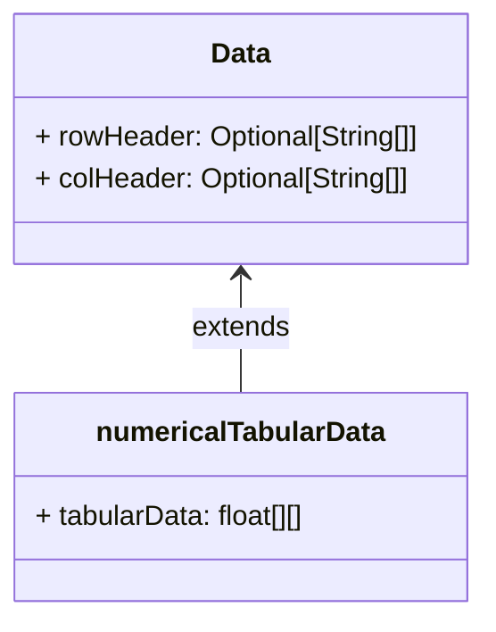
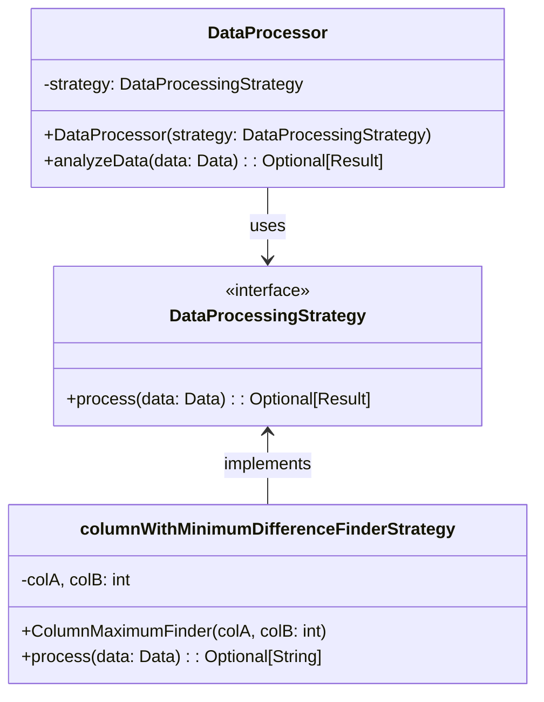
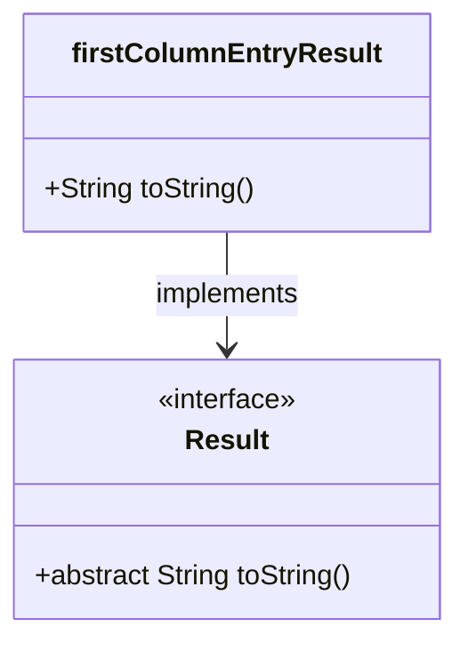

# Romans Solution

The main class uses all of the above to get print a result. By default, it will read the weather data and use the `columnWithMinimumDifferenceFinderStrategy` to find the day with the smallest temperature spread.

If the flag `--football` is passed, it will read the football data and use the same strategy to find the team with the smallest goal difference. The Readers will take care of the different data formats.

## Use Cases

The app should handle two `UseCase`s, one for football and one for weather.

## Data Sources

The data sources are CSV files. In the future, they may be JSON or XML or something else. They may also come from somewhere other than files, like as a database or a web service.

We'll use a factory pattern to create the correct `DataSource` for the given `UseCase`.

## Tabular Data

The `Data` itself is a little troublesome. Since it comes from a CSV file, it's tabular data. But:

- we don't know if the first row is a header or not (but probably is)
- we don't know if the first column is a header or not (but probably isn't)
- we don't know if the data is numeric or date-like or string or a mixture

So for for the abstract base class, we'll only have optional row and column headers. The `numericalTabularData` class will have the actual data.

The DataReaders are responsible for parsing the data from the `DataSource` into the `numericalTabularData` object. They should throw an exception if the data is not or somehow corrupt.

## Data Processing

To get what we want from the data, we'll use the strategy pattern. The strategy is also responsible for casting the data to the correct type (a different strategy may for example compare dates or strings)

Choosing which `Result` type to return is the task of the `Strategy`.

## Results

A `Result` can be either a String (if we're looking for a name in a row or col header for example) or a number or tuple or anything.

Specific Results must be subclasses of `Result`.

